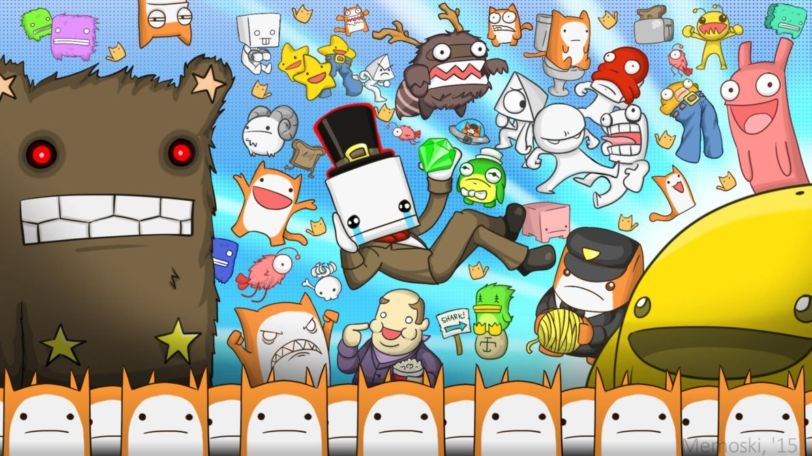
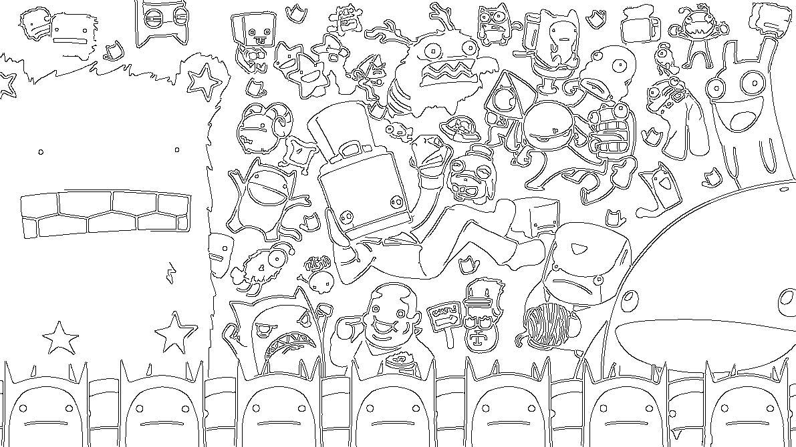

# GoCV Paint
## Description
Tiny command line tool to create coloring pictures, it extracts black contours from the full-color input image.

## Requirements
* Go >= 1.12
* GoCV & OpenCV 4.0.1 installed (check out [gocv.io](https://gocv.io/getting-started) page for details)

## Build
```
go get github.com/bravo2zero/gocvpaint
go build
```

## Usage


```
# get usage info
gocvpaint -h

# process input.jpeg into output.jpeg and display input/output
gocvpain -i input.jpeg -o output.jpeg -d
```

